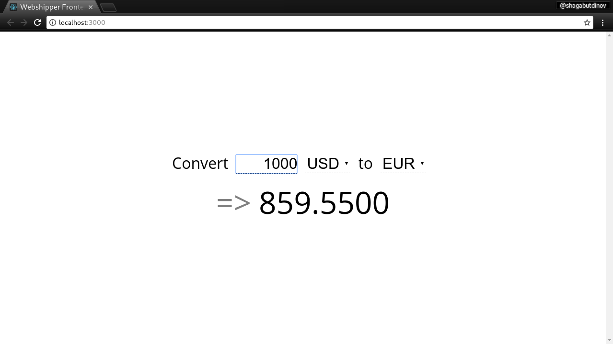

Webshipper Frontend Test Task
=============================

This is frontend for webshipper task. Backend can be found here:
[http://github.com/shagabutdinov/webshipper-task](http://github.com/shagabutdinov/webshipper-task)

Comments
--------

This is React application that contains simplest frontend for exchange
conversion rates calculator.



Installation
------------

```
$ git clone git@github.com:shagabutdinov/webshipper-frontend-task.git
$ cd webshipper-frontend-task
$ npm install
```

Usage
-----

Note that running backend application is required in order to use frontend.

```
# start the application
$ npm start
# default browser will open a http://localhost:3000 page
```
